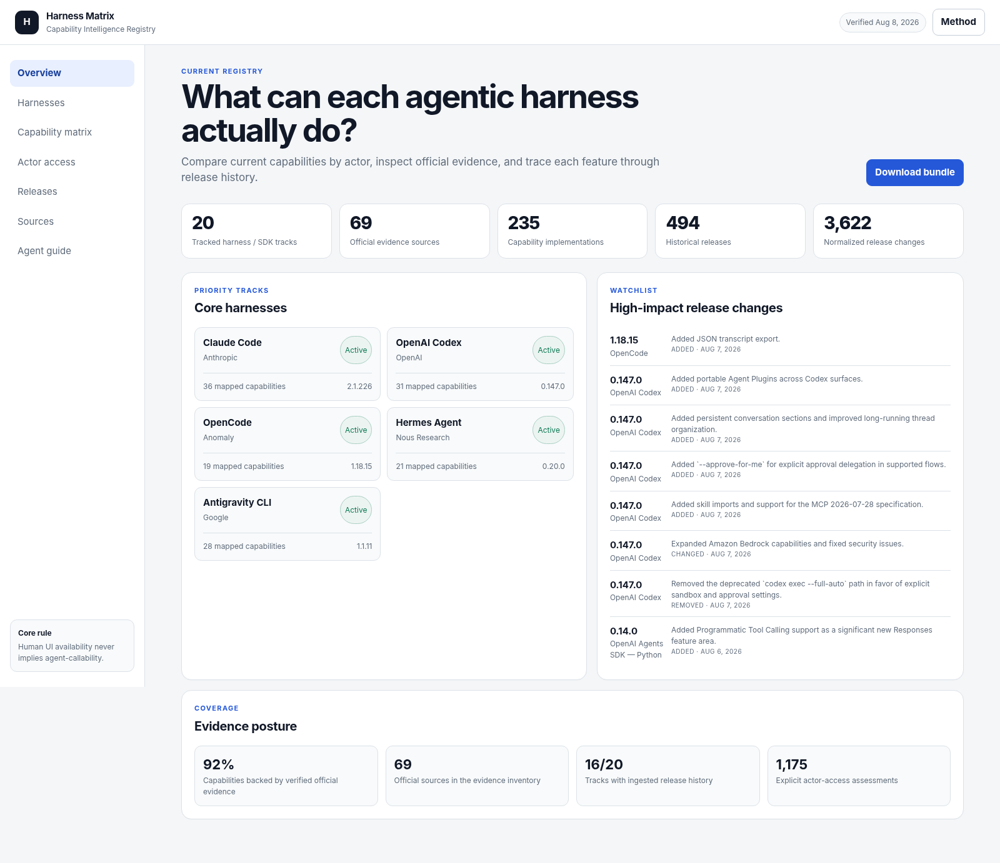

# Harness Capability Registry

Evidence-backed release intelligence and actor-aware capability comparison for agentic harnesses and SDKs.

## What this is

The **Harness Capability Registry (HCR)** is the implementation layer of a broader **Harness Capability Intelligence** subsystem for an Agentic Operating System.

It maintains two synchronized representations:

1. **Release-event ledger** — immutable or source-faithful records of what changed in each upstream release.
2. **Current capability graph** — normalized, comparable claims about what each harness can do now, for which actor, through which surface, and with what evidence.

The materialized per-product artifact is a **HarnessBOM**. The included browser UI is the **Harness Matrix**.



## Start here

- Open `generated/Harness_Matrix_Standalone.html` for the complete browser UI with embedded data.
- Read `docs/DELIVERY_GUIDE.md` for the artifact map and integration path.
- Read `specs/00_Harness_Capability_Intelligence_Spec.md` for the canonical architecture.
- Use `prompts/DEEP_RESEARCH_PROMPT.md` for the full evidence-hardening and historical-backfill research run.
- Feed `generated/agent-guides/<harness-id>.json` to an agent or control-plane adapter.

## Why two representations are required

A changelog is historical but often incomplete, inconsistent, or UI-centric. Product documentation describes current state but frequently loses version lineage. HCR keeps both and never treats a human-facing UI feature as agent-callable by implication.

## Seed scope

Core harnesses:

- Claude Code
- OpenAI Codex
- OpenCode
- Hermes Agent
- Google Antigravity CLI

Historical and secondary harnesses:

- Gemini CLI, with successor linkage to Antigravity CLI
- Qwen Code
- goose
- GitHub Copilot CLI
- Pi Agent

Agent SDKs:

- Claude Agent SDK for Python and TypeScript
- Codex SDK for Python and TypeScript
- OpenAI Agents SDK for Python and JavaScript/TypeScript

Provider SDKs:

- OpenAI Python and Node SDKs
- Anthropic Python and TypeScript SDKs

## Actor model

Each capability is evaluated independently for:

- `human_operator`
- `in_harness_agent`
- `external_orchestrator`
- `ci_runner`
- `administrator`

Access values are:

- `native`
- `supported`
- `configurable`
- `experimental`
- `mediated`
- `unavailable`
- `unknown`
- `deprecated`

`unknown` means evidence is missing. It does **not** mean unavailable.

## Repository layout

```text
.
├── app/                         Static Harness Matrix web application
├── agents/                      Curator and audit agent prompts
├── generated/
│   ├── agent-guides/            Per-harness JSON and Markdown guides
│   ├── reports/                 Coverage and validation reports
│   └── registry.bundle.json     Full materialized bundle
├── hcr/                         Python collection/generation/validation package
├── prompts/                     Deep-research and normalization prompts
├── raw/                         Upstream snapshots and seeded changelogs
├── registry/
│   ├── registry-meta.json
│   ├── sources.json
│   ├── harnesses.json
│   ├── taxonomy.json
│   ├── capabilities.json
│   └── releases.json
├── schemas/                     JSON Schema 2020-12 definitions
├── specs/                       Architecture, operations, and integration specs
└── tests/                       Offline deterministic tests
```

## Run locally

Prerequisites:

- Python 3.11+
- Optional: a `GITHUB_TOKEN` for higher GitHub API limits

```bash
python -m pip install -e '.[dev]'
python scripts/build_seed.py
python -m hcr generate
python -m hcr validate
python -m hcr serve --port 8765
```

Open `http://127.0.0.1:8765`.

## Update from upstream sources

Networked update, including documentation drift snapshots:

```bash
GITHUB_TOKEN=... python -m hcr update --since-days 120 --snapshot-docs
```

Offline regeneration from checked-in snapshots:

```bash
python -m hcr update --offline --no-snapshot-docs
```

Target a single harness:

```bash
python -m hcr update --harness claude-code --since-days 120
```

## Quality policy

- Official changelogs, release feeds, repositories, package registries, and documentation are primary evidence.
- Official cross-vendor compatibility matrices can corroborate but do not replace first-party evidence.
- Raw evidence and normalized interpretation remain separate.
- Deterministic extraction produces candidates; review or documentation corroboration promotes capability claims.
- Product rename, transition, predecessor, and successor events are first-class records.
- A source failure never silently converts an existing capability to unavailable.

## Key generated artifacts

- `generated/agent-guides/<harness-id>.json` — minimal agent-consumable routing guide
- `registry/harnesses/<harness-id>.json` — full HarnessBOM materialized view
- `generated/registry.bundle.json` — complete application/API bundle
- `generated/reports/coverage.md` — evidence coverage report
- `generated/validation-report.json` — invariant and JSON Schema validation
- `generated/source-drift-report.json` — documentation source drift, after a networked snapshot run

## Design status

This package is an initial working implementation. Raw changelog-backed products have broad seeded history. Products whose authoritative history lives only in GitHub release bodies or package registries have curated seed entries and are designed for automated backfill during the first networked update.
