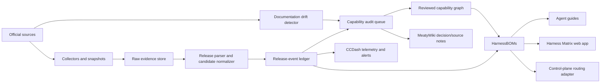

# Harness Capability Intelligence System Spec

## 1. Purpose

Harness Capability Intelligence (HCI) continuously answers:

> Given a task, actor, risk boundary, execution environment, and installed version, which harness capabilities are actually available—and what evidence supports that conclusion?

The initial implementation is the **Harness Capability Registry (HCR)**. Its per-product materialized artifact is the **HarnessBOM**. Its human-facing browser is the **Harness Matrix**.

## 2. Problem

Agentic harnesses change too rapidly for static workflow guidance.

Current failure modes include:

- An agent assumes a feature does not exist because its training data predates the release.
- A workflow uses terminal scraping despite a supported SDK, RPC server, MCP server, or JSON event stream.
- A human-facing UI capability is incorrectly assumed to be callable by an in-harness agent.
- A documented current capability has no traceable introduction version.
- Release notes describe a feature, but later documentation quietly changes, limits, or deprecates it.
- A product is renamed or superseded, but routing logic continues treating the predecessor as the default.
- Provider SDK changes are missed even though they unlock new agent-runtime behavior.
- Each project independently researches the same harness and reaches inconsistent conclusions.

## 3. Core design decision

HCI maintains two linked but non-identical systems of record.

### 3.1 Release-event ledger

An append-oriented historical record of upstream releases and normalized change items.

It preserves:

- Version and channel
- Publication and retrieval time
- Raw source location and content hash
- Original release-note text or source-faithful excerpt
- Candidate capability references
- Security, breaking-change, and deprecation flags
- Normalization method, confidence, and review status

### 3.2 Current capability graph

A reviewed materialization of what is currently available.

It records:

- Canonical capability identifier
- Product-specific implementation
- Actor-specific access state
- Invocation surface and command/API
- Minimum known version
- Current version verified
- Human mediation requirement
- Limitations and known non-parity
- Evidence claims with source and verification time

Neither view replaces the other. The ledger explains **when and how the product changed**; the graph explains **what an agent may rely on now**.

## 4. System boundaries

### In scope

- Agentic coding harnesses
- General agent harnesses relevant to software and knowledge workflows
- Agent SDKs that embed a harness or agent loop
- Provider SDKs whose changes affect agent runtime capabilities
- Official changelogs, GitHub releases, package registries, current docs, and lifecycle announcements
- Historical backfill, scheduled collection, normalization, review, comparison, and agent-readable publishing
- Product lineage and successor/predecessor mapping

### Out of scope for the seed

- Runtime benchmarking of quality, cost, or latency
- Installation-state detection on every endpoint
- Automatic promotion of all extracted release-note text into verified capability claims
- Community sentiment as authoritative capability evidence
- Complete binary/API compatibility testing
- License and commercial-entitlement interpretation beyond explicit official statements

Those are planned integrations with CCDash and Governance rather than reasons to overload the registry.

## 5. Actors

| Actor | Meaning | Typical question |
|---|---|---|
| `human_operator` | A person using TUI, IDE, desktop, or web UI | Can Nick invoke and steer this directly? |
| `in_harness_agent` | The model operating inside the harness | Can the model itself discover or invoke it? |
| `external_orchestrator` | Another agent/control plane calling the harness | Is there a supported machine interface? |
| `ci_runner` | Unattended workflow or scheduled job | Can this run deterministically without a person? |
| `administrator` | Platform or workspace administrator | Can policy, identity, rollout, or defaults be governed? |

A capability may be native for one actor and unavailable for another.

## 6. Access semantics

| Value | Meaning |
|---|---|
| `native` | First-class, direct, and intentionally supported for the actor |
| `supported` | Supported, but not the primary/default path |
| `configurable` | Available after configuration or administrative enablement |
| `experimental` | Explicitly preview, beta, or unstable |
| `mediated` | Reachable only through another actor or approval boundary |
| `unavailable` | First-party evidence explicitly establishes non-availability |
| `unknown` | Evidence is insufficient |
| `deprecated` | Present only for transition and should not be selected for new work |

The most important rule is:

> Missing evidence maps to `unknown`, never automatically to `unavailable`.

## 7. Architecture



## 8. Components

### 8.1 Source registry

Declarative inventory of official sources, ownership, purpose, collector type, refresh cadence, and staleness service level.

### 8.2 Collectors

- GitHub Releases API
- Raw Markdown changelog snapshotter/parser
- PyPI JSON API
- npm registry API
- Generic documentation snapshotter and hash-drift detector

Future collectors should implement the same source-to-evidence contract.

### 8.3 Evidence store

Raw snapshots are immutable by timestamp. A canonical local seed path may be refreshed for reproducible offline parsing, while timestamped copies retain provenance.

### 8.4 Normalizer

Deterministic heuristics classify change kind, category, likely actor, likely surface, and candidate capability references. This is triage—not authoritative semantic review.

### 8.5 Curator workflow

A research/curator agent compares changed release notes and documentation against existing capability claims, proposes patches, and attaches evidence. High-impact security, deprecation, or actor-reachability changes require human approval.

### 8.6 Materializer

Generates:

- Per-harness release files
- Per-harness capability files
- HarnessBOMs
- Minimal agent-routing guides
- Complete web/API bundle
- Coverage and validation reports

### 8.7 Validator

Checks:

- JSON Schema conformance
- Unique identifiers
- Referential integrity among sources, harnesses, capabilities, taxonomy, and releases
- Allowed actor-access values
- Required evidence for verified claims
- Product-lineage references
- Release change counts

## 9. Capability taxonomy

The seed taxonomy contains 38 comparable concepts across:

- Interaction
- Execution
- Extensions
- Context and memory
- Session state
- Orchestration
- Runtime
- Automation
- Security and governance
- Observability
- Models and providers
- Research and computer-use tools
- Interfaces
- Evaluation

The taxonomy represents stable comparison questions, not vendor marketing names. Vendor-specific terms remain in implementation summaries and evidence.

## 10. Workflow

1. Discover or register an official source.
2. Snapshot it and record source metadata/hash.
3. Parse releases into source-faithful events.
4. Normalize individual release changes as candidates.
5. Detect documentation or lifecycle-source drift.
6. Compare candidates against the current capability graph.
7. Propose additions, modifications, deprecations, or lineage events.
8. Review high-impact or low-confidence changes.
9. Materialize HarnessBOMs and agent guides.
10. Validate all schemas and references.
11. Publish the static UI and machine bundle.
12. Notify the control plane and CCDash of meaningful deltas.

## 11. Agent routing contract

A control-plane query should provide:

```json
{
  "task_requirements": ["execution.headless", "execution.structured_output"],
  "actor": "external_orchestrator",
  "environment": "local_linux",
  "risk_profile": "workspace_write_with_approval",
  "version_constraints": {},
  "preferences": {
    "provider_portability": "preferred",
    "self_hosted": "optional"
  }
}
```

The response should include candidate harnesses, evidence freshness, missing requirements, mediation boundaries, and a reasoned selection. It must not return a bare popularity ranking.

## 12. Success criteria

- New upstream releases appear in the ledger within the source SLA.
- Agents can distinguish human-only, agent-native, externally callable, CI-safe, and administrator-only surfaces.
- Every verified capability has at least one official evidence claim.
- Product transitions change routing recommendations without deleting historical context.
- A workflow author can produce an accurate harness-specific implementation plan without re-researching basic capabilities.
- Source or normalization uncertainty is visible rather than collapsed into false certainty.
- The registry can be regenerated and validated offline from checked-in snapshots.

## 13. MVP status

Implemented in the seed:

- Declarative source registry
- Five collector classes
- Historical release ledger
- Actor-aware capability graph
- JSON Schemas
- Per-harness HarnessBOMs and agent guides
- Static comparison web application data bundle
- Validation and coverage reports
- Scheduled update design
- Curator/auditor agent prompts

Remaining before production promotion:

- First complete networked backfill for all GitHub-release-only tracks
- Documentation-diff semantic extraction rather than hash-only detection
- Review queue UI and signed approvals
- Runtime/version inventory adapters for Nick's actual endpoints
- CCDash performance evidence and task-outcome feedback
