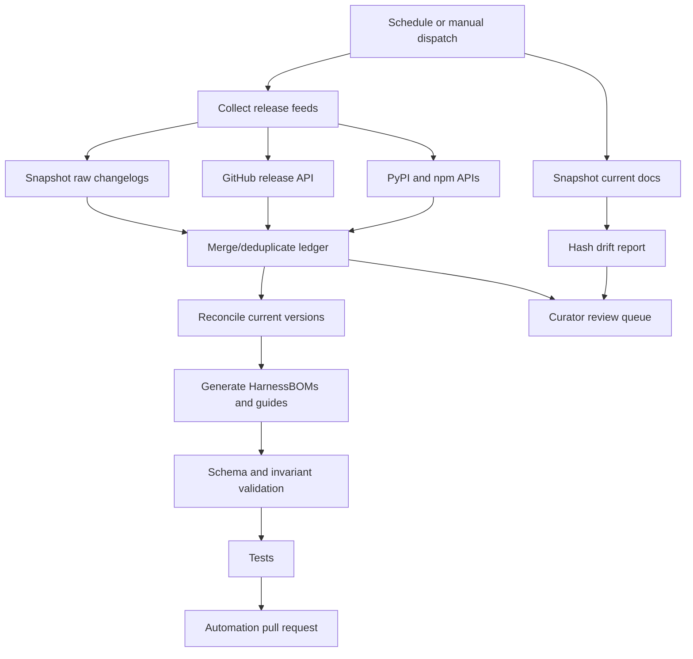

# Automation and Operations

## 1. Pipeline



## 2. Commands

### Full update

```bash
GITHUB_TOKEN=... python -m hcr update \
  --since-days 120 \
  --snapshot-docs \
  --strict
```

### Release collection only

```bash
python -m hcr collect --since-days 120
```

### Documentation drift only

```bash
python -m hcr snapshot
```

### Offline deterministic build

```bash
python scripts/build_seed.py
python -m hcr generate
python -m hcr validate
pytest
```

## 3. Collection behavior

### Markdown changelogs

- Remote source is snapshotted with retrieval metadata and SHA-256.
- Canonical local seed is refreshed.
- On fetch failure, the checked-in local snapshot is parsed and the failure is reported.
- Each version section becomes a release event.

### GitHub Releases

- API pagination is bounded by `since_days` and `max_pages`.
- Drafts are ignored.
- Prereleases can be included or excluded.
- Release bodies become normalized change candidates.
- Raw API responses are retained.

### Package registries

- PyPI and npm version histories are timestamp-filtered.
- Registry metadata creates verified distribution events.
- Package publication alone does not imply a new semantic capability.

### Documentation

- Current docs and lifecycle sources are snapshotted.
- Hash changes enter a drift report.
- Semantic capability changes require curator review; hash drift alone never modifies actor access.

## 4. Merge rules

Release ID is the natural deduplication key.

- Immutable GitHub/package metadata enriches mutable changelog records.
- Precise dates replace missing dates.
- Human-approved normalized changes are preserved over newly generated candidates.
- Raw source snapshots remain available even after merge.

## 5. Scheduled workflow

Recommended schedule: every six hours with manual dispatch.

The workflow should:

1. Check out the canonical branch.
2. Install Python and development dependencies.
3. Run networked update and documentation snapshot.
4. Run tests and validation.
5. Generate an update summary.
6. Create or refresh a single automation pull request.
7. Require human review when security, deprecation, lifecycle, or critical actor-access changes are detected.

## 6. Alert classes

| Class | Examples | Default handling |
|---|---|---|
| Informational | Version publication, bug fix | Include in update PR |
| Capability candidate | New headless flag, SDK method, skill surface | Curator review |
| Breaking/deprecation | Removed command, renamed config | Human review and workflow-impact scan |
| Security/governance | Sandbox, permission, credential, approval changes | Block auto-merge |
| Lifecycle | Successor announcement, service termination | Control-plane routing review |
| Documentation drift | Hash change without release note | Semantic audit task |

## 7. Failure handling

- Collection failure is explicit in `generated/collection-report.json`.
- A partial source outage does not erase prior evidence.
- Strict mode fails the automation run when any source fails.
- Non-strict mode allows a local/offline build while preserving warnings.
- Validation failure prevents publication.
- No updater writes `unavailable` based solely on a failed fetch.

## 8. Security

- `GITHUB_TOKEN` is read from environment only.
- Raw snapshots may contain credentials only if upstream accidentally publishes them; credential scanning should be added before enterprise promotion.
- Third-party actions should be pinned or avoided.
- Automation writes to a review branch, not directly to the protected canonical branch.
- Package attestations/digests should be retained when available.

## 9. Observability

Emit CCDash-compatible events for:

- Source success/failure and latency
- Number of new/changed releases
- Number of documentation drifts
- Number of capability candidates
- Review turnaround
- Validation errors
- Coverage by harness and source tier
- Downstream workflows affected by a breaking change

## 10. Production hardening backlog

- ETag/Last-Modified conditional requests
- Retry with exponential backoff
- GitHub GraphQL or release-tag reconciliation for projects with nonstandard releases
- Package-signature/attestation validation
- DOM-aware documentation diffs
- Semantic diff agent with deterministic claim extraction schema
- Signed curator approvals
- Provenance graph in MeatyWiki
- Webhook/event publication to the Agentic Control Plane
